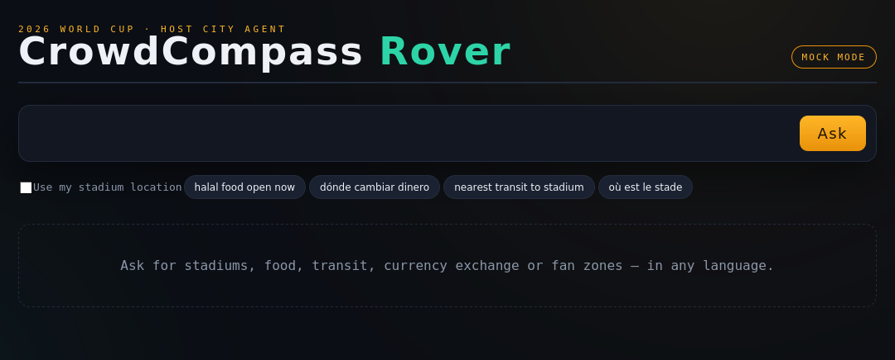
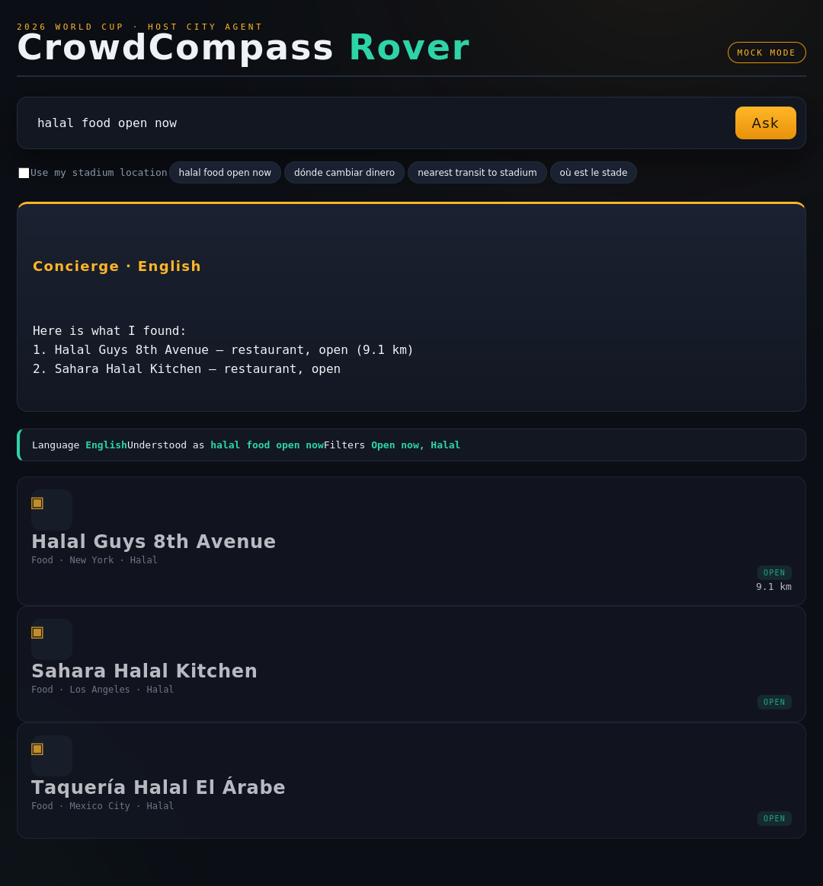
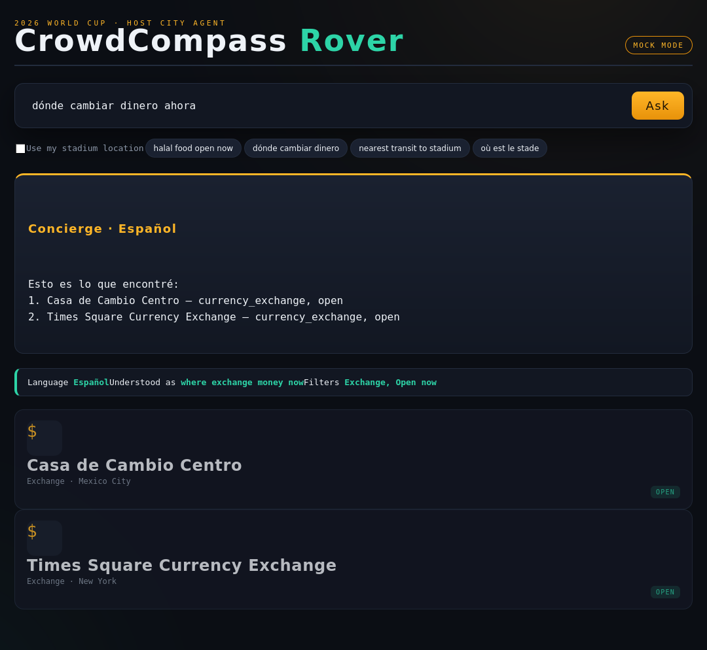

# CrowdCompass Rover — User Guide

**Document:** `docs/04-USER-GUIDE.md` · **Audience:** host-city visitors, tourism &
fan-experience teams · **Updated:** 2026-06-01

CrowdCompass Rover answers your "where / how / what now" questions about a 2026 World Cup
host city — in your own language. Ask for the nearest open halal restaurant, the cheapest
route to the stadium, or where to change money, and it searches live city/event data and
replies with grounded, cited results.

---

## 1. The home screen

When you open Rover you see the search bar, a location toggle, and quick-start example
chips. The badge top-right shows whether the system is running in **mock** mode (offline
demo data) or **real** mode (live Elastic + Gemini).

**Screen elements**
1. **Title bar** — product name and the active-mode badge.
2. **Search box** — type a question in any supported language and press **Ask** or hit
   Enter.
3. **"Use my stadium location"** — when ticked, results are filtered to what's nearby and
   each result shows its distance.
4. **Example chips** — one tap runs a sample query.

---

## 2. Asking a question (English)

Type a request such as *"halal food open now"* and press **Ask**. Rover:

1. Shows a **Concierge** answer card summarising the best options in your language.
2. Shows a **plan strip** explaining what it understood — detected language, the
   normalised query, and the filters it applied (here: *Open now, Halal*).
3. Lists ranked **result rows**, each with a category glyph, city, dietary/accessibility
   tags, an Open/Closed badge, and distance when a location is set.

> **Tip.** The plan strip is your transparency window: if a filter looks wrong, rephrase.
> For example, add "open now" to hide closed venues, or name a city to narrow results.

---

## 3. Asking in another language

Rover detects the language automatically and answers in the same language. Ask
*"dónde cambiar dinero ahora"* and the answer card switches to **Español**, while the plan
strip still shows the English normalisation so teams can audit what was understood.

Supported answer languages today: English, Español, Français, Português, Deutsch, العربية.
Queries in other languages still work; answers fall back to English.

---

## 4. Using your location

Tick **Use my stadium location** before asking. Rover then:
- restricts results to those within range, and
- shows the distance (in metres under 1 km, otherwise kilometres) on each row,
sorted so the most relevant nearby option is first.

This is ideal for "nearest open …" and "cheapest route to the stadium" style questions.

---

## 5. Reading a result row

| Element | Meaning |
|---------|---------|
| Glyph | Category (stadium ◈, food ▣, transit ▷, exchange $, fan zone ✦, …) |
| Name | Venue / event name |
| Meta line | Category · city · dietary & accessibility flags |
| Badge | **Open** (green) or **Closed** (red) right now |
| Distance | Shown only when location is enabled |

---

## 6. Worked examples

| You ask | Rover understands | You get |
|---------|-------------------|---------|
| `halal food open now` | category=food, halal, open-now | Nearby open halal spots, cited |
| `où est le stade` | French, category=stadium | Stadiums, answered in French |
| `dónde cambiar dinero ahora` | Spanish, category=exchange, open-now | Open exchanges, answered in Spanish |
| `nearest transit to stadium` (location on) | category=transit, proximity | Closest transit with distances |

---

## 7. Troubleshooting

- **"No matching places found."** Try a broader phrasing, remove a city name, or turn off
  the location filter to widen the radius.
- **Answer came back in English for a non-English question.** That language isn't in the
  localized answer set yet; the results themselves are still correct.
- **Mode badge says "mock".** You're seeing demo data. Connect live credentials (see the
  access requirements doc) and restart in real mode for live city data.
